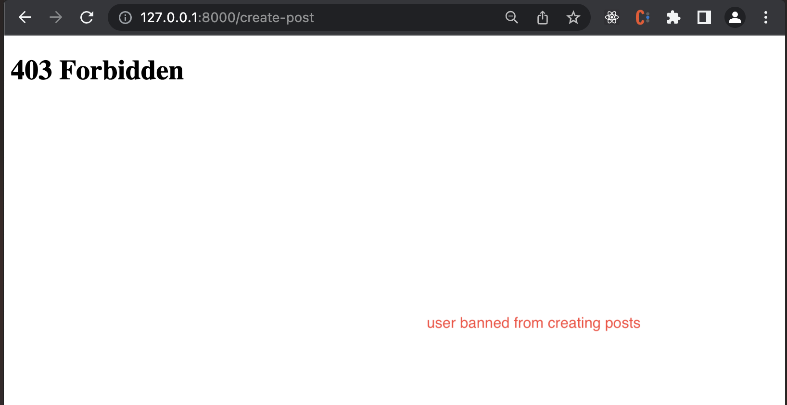

# user_post

Description
---
A Django app that allows users to create an account, login, and create posts that are viewable to all users.

There are two types of users:
    - standard user
        - can create post
        - can only remove their own posts

    - mod user
        - can create post
        - can remove their own posts
        - can remove other users posts
        - can ban a user from creating posts

Installation
---

1. Clone / download repo
2. Install Python3
    - ```https://www.python.org/downloads/```

MacOS / Linux

3. Open terminal and navigate to repo directory root

4. Create and initialize virtual environment, in terminal enter:
    1. ```python3 -m venv venv```
    2. ```source venv/bin/activate```
5. Install requirements
    - ```pip install -r requirements.txt```
6. Run server

    ** Note: .env file does not contain secrets, therefore, app will not work unless valid details are provided <br>
    - ```python ./manage.py runserver```


Screenshots
---



