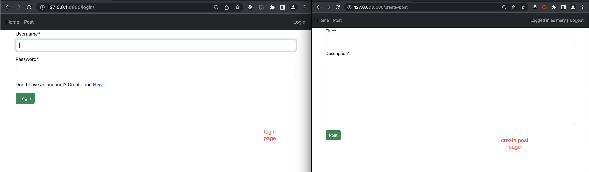
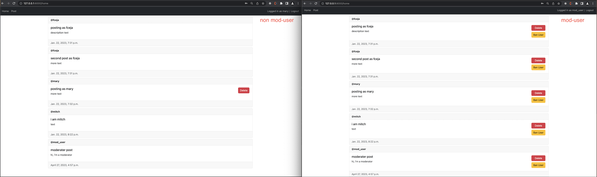
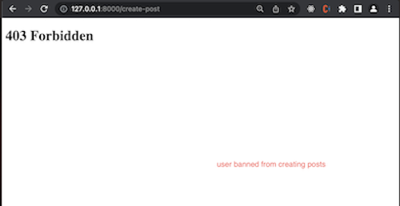

# Description
A forum-like app created with Django framework.</br>
App allows users to create an account, login, and create posts that are viewable to all users on the community home page.</br>

You can view implementation here -> [heroku-django-user-post](https://django-user-post-a42f5d79d28f.herokuapp.com/)

There are three types of users:
```
- standard user
    - can create post
    - can remove their own posts
```
```
- mod user
    - can create post
    - can remove their own posts
    - can remove other users posts
    - can ban a user from creating posts
```
```
- banned user
    - can not create posts
    - can delete their own existing posts
```

# Installation


</br>
** Note: must rename sample.env file to .env, and fill with valid values
</br>
</br>

1. Clone repo
2. Install Python3
    - ```https://www.python.org/downloads/```

3. Open terminal, navigate to repo project root.

4. Setup virtual environment, in terminal enter:
    1. ```python3 -m venv venv``` - creates virtual environment
    2. ```source venv/bin/activate``` - initializes virtual environment
       - ** Note - you should see ```(venv)``` in terminal when successfully initialized
5. Install project requirements
    - ```pip install -r requirements.txt```
6. Run server
    - ```export DJANGO_ENV=development && python ./manage.py runserver```


# Technologies & Tools
<a href="https://www.python.org/" target="_blank" rel="noreferrer">
    
</a>
<a href="https://www.djangoproject.com/" target="_blank" rel="noreferrer">
    
</a>
<a href="https://getbootstrap.com" target="_blank" rel="noreferrer">
    
</a>
<a href="https://www.w3.org/html/" target="_blank" rel="noreferrer">
    
</a>
<a href="https://developer.mozilla.org/en-US/docs/Web/CSS" target="_blank" rel="noreferrer">
    
</a>
<a href="https://www.postgresql.org/" target="_blank" rel="noreferrer">
    
</a>
<a href="https://www.heroku.com/" target="_blank" rel="noreferrer">
    
</a>
</br>
</br>


# Screenshots




